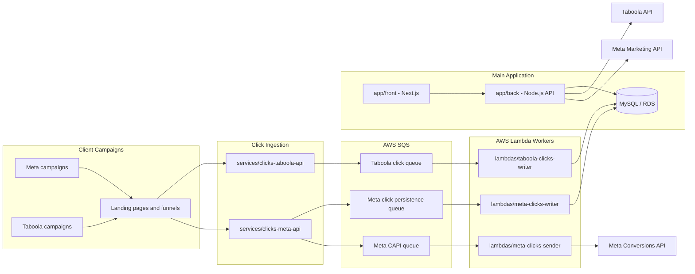
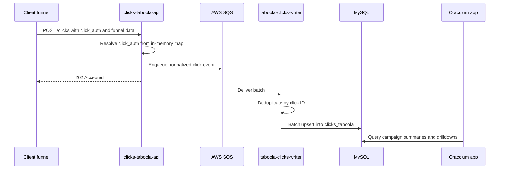
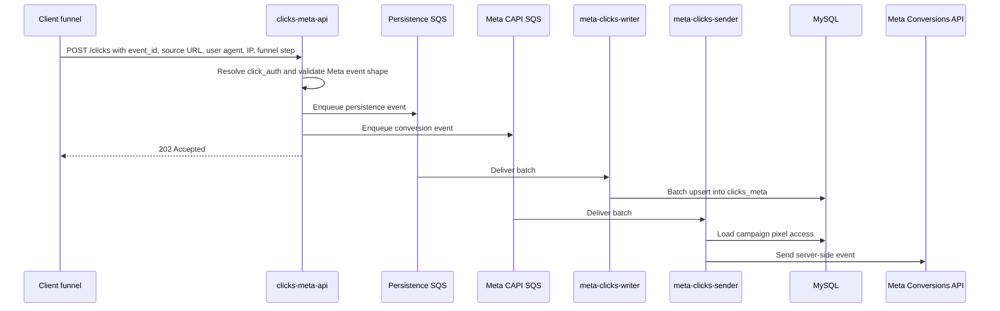

# Oracclum

Oracclum was a campaign attribution and optimization platform for paid traffic teams running Taboola and Meta campaigns.

This repository is a sanitized portfolio reconstruction of production systems I built and operated as Oracclum's co-founder. Credentials, customer data, proprietary deployment values, and company-sensitive details have been removed or replaced. The code included here may differ from the exact production code, but the architecture, service boundaries, and core engineering problems reflect the real system.

## Production Context

At peak commercial usage, the company reached:

- 10 active client accounts using the platform at the same time commercially
- 50+ tracked campaigns
- 2.5M+ captured events per day
- 870K+ events per minute of ingestion capacity
- R$20M+ in tracked revenue

The client-account number reflects company traction at the time, not a platform concurrency limit.

The main engineering challenge was building a system that could ingest high-volume campaign events with low latency, process them asynchronously, and expose useful campaign intelligence to users without coupling the tracking path to dashboard workloads.

## System Overview

Oracclum was split into a client-facing application, high-throughput event ingestion APIs, and SQS-triggered workers.



## How The Pieces Worked Together

The main app let customers connect ad-provider accounts, create campaigns, configure tracking, and review performance by campaign, site, ad, adset, and funnel step. The frontend used Next.js with server-side API routes acting as a BFF layer over the Node.js backend. The backend handled authentication, user/account management, campaign setup, provider integrations, and reporting queries.

The Clicks APIs were kept separate from the main backend because they served a different workload. Their job was to accept campaign events quickly, validate each `click_auth` token from an in-memory campaign map, enrich events with the internal campaign ID, and enqueue work to SQS. Before sending to SQS, events were buffered for a short batching window and sharded by click ID so duplicate or partial events arriving together could be merged with the strongest observed signals, reducing queue writes without adding latency to the request path. This avoided a database read on every click and kept the ingestion path resilient during traffic spikes.

The Lambda workers consumed SQS batches and persisted click progress to MySQL. They deduplicated events by click ID and used upsert semantics so partial events could arrive in any order without losing stronger funnel progress. For example, a later event could fill missing ad or site metadata, while step fields kept the greatest observed value.

For Meta campaigns, the ingestion API also fanned events out to a separate queue for Meta Conversions API delivery. The sender Lambda loaded campaign pixel credentials from MySQL and dispatched validated events to Meta in parallel, while returning per-message failures to SQS so failed records could be retried.

## Event Flows

### Taboola Click Tracking



### Meta Click Tracking And CAPI Dispatch



## Funnel Semantics

Tracked events represented progressive funnel visibility rather than a single linear request.

- `step_1`, `step_2`, and `step_3` represented intermediate pageview/view-content milestones configured in the customer's funnel.
- `checkout` represented checkout pageview/view-content activity.
- Revenue attribution was tracked separately from the click ingestion path.

The click writers were designed around duplicate and partial event delivery. Instead of treating each event as a full replacement, the workers merged events by click ID and preserved the most advanced observed step state.

## Repository Layout

This monorepo is organized by runtime boundary. The current public portfolio
snapshot includes the main application frontend and backend:

```text
app/
  front/                       Next.js client application and BFF routes
  back/                        Node.js backend API for auth, campaigns, integrations, and reporting
```

The original production system also included separate ingestion services,
Lambda workers, and operations/product documentation. Those runtime boundaries
are described here for system context, but their source folders have not been
restored into this repository snapshot yet:

```text
services/
  clicks-taboola-api/          Go API for high-throughput Taboola click ingestion
  clicks-meta-api/             Go API for Meta click ingestion and CAPI queue fanout

lambdas/
  taboola-clicks-writer/       SQS-triggered Go worker that writes Taboola clicks to MySQL
  meta-clicks-writer/          SQS-triggered Go worker that writes Meta clicks to MySQL
  meta-clicks-sender/          SQS-triggered Go worker that sends Meta CAPI events

docs/
  architecture/                System diagrams and implementation notes
  operations/                  Deployment, scaling, observability, and incident notes
  product/                     Product behavior, funnels, and user workflows
```

## Engineering Highlights

- End-to-end product ownership across frontend, backend, infrastructure, deployment, integrations, and customer support.
- High-throughput Go ingestion services with in-memory campaign-token resolution to avoid per-event database reads.
- SQS-based buffering between ingestion and persistence to absorb burst traffic and isolate failures.
- Batch-oriented Lambda workers with deduplication and idempotent MySQL upserts.
- Separate Meta CAPI dispatch pipeline with per-message retry behavior.
- Full-stack client dashboard for campaign creation, provider setup, funnel analysis, and campaign optimization.
- Practical service boundaries between user-facing workflows and event-processing workloads.

## Documentation Roadmap

This top-level README explains the system at portfolio-review depth. The
included application folders each have their own README and supporting docs. As
additional services are moved into this repository, they should receive their
own documentation covering:

- Service purpose and ownership boundary
- Local setup
- Environment variables
- API contracts
- Data models
- Failure modes and retry behavior
- Tests
- Deployment notes
- Known tradeoffs and future improvements

## Public Portfolio Note

This repository is intended to demonstrate production engineering judgment, written communication, and product ownership. It is not a turnkey open-source release of the original Oracclum platform.
