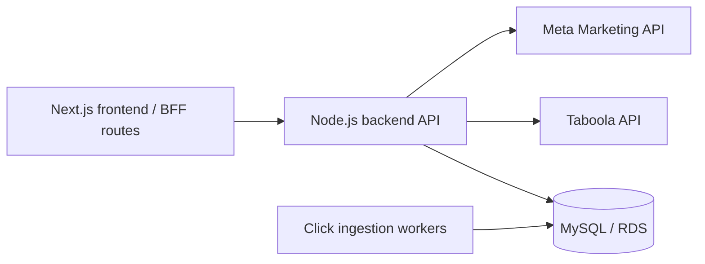

# Oracclum Backend

This repository contains the Node.js backend API for Oracclum, a campaign attribution and optimization platform for paid traffic teams running Taboola and Meta campaigns.

This codebase is being prepared as part of a sanitized portfolio reconstruction of production systems I built and operated as Oracclum's co-founder. Credentials, customer data, proprietary deployment values, and company-sensitive details have been removed or replaced. The code may differ from the exact production code, but the architecture, service boundaries, and core product problems reflect the real system.

## Production Role

In the broader Oracclum system, this service was the backend for the main client-facing application. It handled customer workflows around accounts, campaigns, integrations, reporting.

The high-throughput click ingestion APIs and SQS-triggered workers were separate runtime boundaries. Their job was to ingest and persist campaign events. This backend consumed the persisted attribution data and exposed it to the dashboard and operational product workflows.

## Backend Responsibilities

- User signup, login, logout, password changes, activation, deactivation, and deletion.
- JWT-based authentication and role-aware middleware.
- User consent and account lifecycle workflows.
- Campaign creation, editing, deletion, link updates, and integration status tracking.
- Taboola credential storage, access token refresh, and campaign reporting queries.
- Meta access token storage, allowed account tracking, and campaign/adset/ad reporting queries.
- Campaign, site, ad, adset, and funnel-step dashboard summaries.
- MySQL persistence for users, campaigns, click summaries, provider account usage, consent records, and logs.

## Architecture

The project follows a Clean Architecture-inspired structure:

```text
src/
  domain/          Business models and usecase contracts
  data/            Usecase implementations and repository protocols
  infra/           MySQL repositories, crypto adapters, and external API adapters
  presentation/    HTTP controllers, middlewares, validation, and errors
  main/            Express setup, route adapters, factories, and dependency wiring
```

Typical request flow:

```text
Express route
  -> route adapter
  -> presentation controller
  -> data usecase
  -> infra repository or external API adapter
```

This separation kept product-facing HTTP concerns away from business usecases and made provider/database integrations replaceable behind interfaces.

See [docs/architecture.md](docs/architecture.md) for a deeper explanation of the layers, request flow, runtime boundaries, and testability tradeoffs.

## Runtime Context

The backend is one piece of a larger attribution system:



The click ingestion services and Lambda workers wrote high-volume event data into MySQL. This backend queried that data for product workflows such as campaign summaries, funnel analysis, site/ad drilldowns, and revenue attribution.

## Setup

Install dependencies:

```bash
npm ci
```

Use Node.js 24.16.0 or newer. The repository includes `.nvmrc`, so `nvm use` will select the portfolio baseline when that version is installed.

Create a local environment file:

```bash
cp .env.example .env
```

Then edit `.env` with your own local values. Real `.env` files are ignored by git.

Run the development server:

```bash
npm run dev
```

Build the TypeScript output:

```bash
npm run build
```

Start the compiled server:

```bash
npm start
```

## Environment Variables

The backend reads configuration from `.env` or process environment variables.

```text
PORT
JWT_SECRET
DEMO_MODE_ENABLED

DB_HOST
DB_PORT
DB_USER
DB_PASSWORD
DB_NAME

DB_DEV_HOST
DB_DEV_PORT
DB_DEV_USER
DB_DEV_PASSWORD
DB_DEV_NAME

DB_TEST_HOST
DB_TEST_PORT
DB_TEST_USER
DB_TEST_PASSWORD
DB_TEST_NAME
```

`DB_*` is used by the production app config, `DB_DEV_*` by the development app config, and `DB_TEST_*` by the opt-in DB test command. `DEMO_MODE_ENABLED=true` enables the safe backend demo login and mocked backend responses for local portfolio review.

See [docs/configuration.md](docs/configuration.md) for the full environment table and command-to-runtime mapping.

## Database

This backend expects a MySQL-compatible database. The portfolio version does not prescribe a local database runtime; reviewers can point the app at any MySQL instance that matches the expected schema.

The clean portfolio schema is documented in [docs/database/README.md](docs/database/README.md), with executable setup SQL in [docs/database/schema.sql](docs/database/schema.sql).

The schema is based on the backend's repository usage instead of a production export, so it includes the tables, columns, indexes, and relationships the app actually needs without unrelated production leftovers.

The backend uses `mysql2`, so local MySQL 8 installations can keep the default `caching_sha2_password` authentication plugin.

## Tests

The default test path is DB-free and safe for portfolio reviewers:

```bash
npm test
npm run test:unit
npm run test:ci
```

Legacy MySQL-backed tests are still available as an explicit opt-in suite:

```bash
npm run test:db
```

These tests require a configured disposable `DB_TEST_*` database and may mutate data.

See [docs/testing.md](docs/testing.md) for the full test strategy and remaining legacy test gaps.

## Verification

Portfolio-safe verification does not require MySQL:

```bash
npm run build
npm test
npm run test:ci
```

`npm run build` compiles TypeScript into `dist`. `npm test` runs the curated DB-free Jest suite. `npm run test:ci` runs the same DB-free suite with coverage enabled.

Optional DB-backed verification is available when you have a disposable MySQL test database configured through `DB_TEST_*`:

```bash
npm run test:db
```

Do not point `DB_TEST_*` at a database you want to keep; the DB-backed suite can mutate data.

## API Overview

Routes are mounted under `/api`.

Detailed route documentation, auth requirements, request notes, and response-shape notes are available in [docs/api.md](docs/api.md).

Account and user workflows:

- `POST /signup`
- `POST /login`
- `POST /logout`
- `POST /change-pass`
- `GET /loadUserData`
- `GET /load-all-users`
- `GET /load-enriched-user-data`
- `POST /delete-my-data`
- `POST /delete-user`
- `POST /deactivate-user`
- `POST /activate-user`

Provider integration workflows:

- `POST /add-taboola-info`
- `GET /load-taboola-info`
- `POST /add-meta-info`
- `GET /load-meta-info`
- `POST /delete-meta-info`

Campaign workflows:

- `POST /add-campaign`
- `GET /load-user-campaigns`
- `GET /load-user-campaigns/:days`
- `POST /edit-campaign`
- `POST /edit-campaign-link`
- `POST /delete-campaign`
- `POST /save-pixel-info`
- `POST /update-integration-status`
- `GET /load-integration-status/:id_campaign`

Reporting workflows:

- `GET /load-campaign-optimization-data/:id_campaign/:days`
- `GET /load-campaign-steps-by-time/:id_campaign/:days`
- `GET /load-campaign-sites-summary/:id_campaign/:days`
- `GET /load-one-site-summary/:id_campaign/:id_site/:days`
- `GET /load-site-steps-by-time/:id_campaign/:id_site/:days`
- `GET /load-ads-summary/:id_campaign/:days`
- `GET /load-ad-summary/:id_campaign/:id_ads_taboola/:days`
- `GET /load-all-meta-adsets/:id_campaign/:days`
- `GET /load-all-meta-ads/:id_campaign/:days`
- `GET /load-one-meta-ad/:id_campaign/:id_ad_meta/:days`
- `GET /click/:id_click`
- `GET /click-meta/:id_click`

Consent and wait list workflows:

- `POST /accept-terms`
- `GET /load-user-consents`
- `POST /add-wait-list`

## Portfolio Readiness Snapshot

Current verification status:

- Build: `npm run build` passes.
- Default tests: `npm test` passes with 32 suites and 126 tests.
- Coverage command: `npm run test:ci` reports approximately 86.83% statements and 86.83% lines for the curated DB-free suite.
- Dependency audit: `npm audit` reports 0 vulnerabilities.

Intentional legacy areas remain documented in [docs/testing.md](docs/testing.md), [docs/security-hygiene.md](docs/security-hygiene.md), and [docs/database/README.md](docs/database/README.md).

## Documentation Map

- [Architecture](docs/architecture.md)
- [API documentation](docs/api.md)
- [Configuration](docs/configuration.md)
- [Database documentation](docs/database/README.md)
- [Testing strategy](docs/testing.md)
- [Security hygiene review](docs/security-hygiene.md)

## Public Portfolio Note

This repository is intended to demonstrate backend architecture, integration work, production product ownership, and practical engineering tradeoffs. It is not a turnkey open-source release of the original Oracclum platform.
