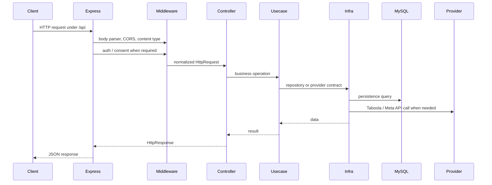
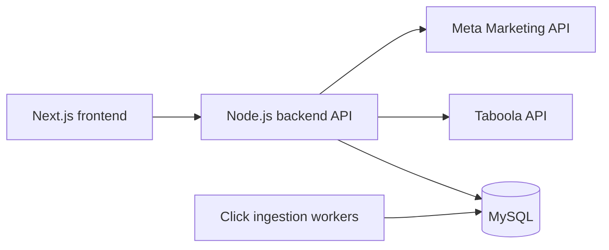

# Architecture

This backend uses a Clean Architecture-inspired structure. The goal is to keep HTTP, persistence, provider APIs, and business usecases separated enough that each layer can evolve independently.

## Directory Map

```text
src/
  domain/          Business models and usecase contracts
  data/            Usecase implementations and repository protocols
  infra/           MySQL repositories, crypto adapters, and external API adapters
  presentation/    Controllers, middlewares, validation, and HTTP errors
  main/            Express setup, route adapters, factories, and dependency wiring
```

## Request Flow



## Layer Responsibilities

### `domain`

Defines business-facing models and usecase contracts. This layer should not know about Express, MySQL, JWT libraries, or provider SDK details.

Examples:

- account models
- campaign models
- click models
- usecase interfaces such as authentication, campaign loading, and provider reporting

### `data`

Implements usecases and defines repository/provider protocols. This layer coordinates business workflows without committing to a concrete database or external API implementation.

Examples:

- authenticate an account
- add or edit a campaign
- load reporting summaries
- clear account data

### `infra`

Contains concrete adapters for external systems.

Examples:

- MySQL repositories under `src/infra/db/mysql`
- JWT and bcrypt adapters
- Taboola and Meta API repositories
- click-auth helper API clients

The current MySQL layer still uses some generic helper functions. Values in reviewed high-risk paths are parameterized, but the broader helper style remains a known future persistence refactor target.

### `presentation`

Contains HTTP-facing controller and middleware logic, expressed through project-owned interfaces instead of direct Express types.

Examples:

- request validation
- controller success/error mapping
- auth middleware
- user-consent middleware
- public error classes

### `main`

Wires the app together.

Examples:

- Express app creation
- global middleware registration
- route registration
- controller factories
- usecase factories
- repository construction

## Authentication And Consent

Authenticated routes use the `x-access-token` header. The auth middleware validates the token, loads the account, and merges `idUser` into the request body for downstream controllers.

Some product routes also require accepted user consent. Those routes run the user-consents middleware after auth and before the controller.

Admin routes reuse the auth middleware with an `admin` role requirement.

## Runtime Boundaries

The original Oracclum system had separate click ingestion services and workers. This backend does not ingest high-volume click events directly in the portfolio version. Instead, it reads persisted click and conversion rows from MySQL for dashboard and campaign workflows.



## Error Handling

Controllers return project-level `HttpResponse` objects. The Express route adapter serializes successful responses directly and serializes errors as:

```json
{ "error": "Public error message" }
```

Tests ensure that stack traces are not sent in JSON API responses.

## Testability

The default test suite focuses on DB-free units. MySQL-backed tests are still available through an explicit opt-in command, but they require a disposable database and are intentionally outside the default portfolio verification path.
