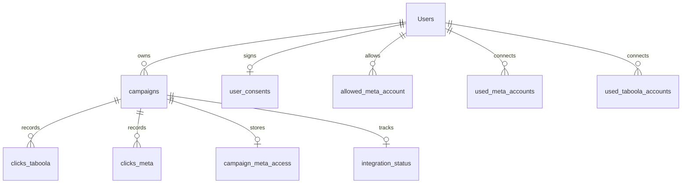

# Database Documentation

This folder documents the clean MySQL schema expected by the portfolio version of the Oracclum backend.

The schema is based on the repository code, especially the MySQL repositories under `src/infra/db/mysql`, instead of a production export. That keeps the portfolio database focused on the tables the backend actually reads and writes, without unrelated production leftovers.

## Runtime Assumptions

- MySQL 8.x or a compatible managed MySQL service.
- InnoDB tables with `utf8mb4` character set.
- The backend uses `mysql2`, which supports MySQL 8's default `caching_sha2_password` authentication.
- The app can point to any database name through `DB_*`, `DB_DEV_*`, or `DB_TEST_*` environment variables.
- No Docker or bundled local database runtime is required by this repo.
- Real `.env` files stay local and ignored by git.

## Setup

Create a database using any name you prefer:

```sql
CREATE DATABASE oracclum_portfolio
  CHARACTER SET utf8mb4
  COLLATE utf8mb4_unicode_ci;
```

Run the schema against that database:

```bash
mysql -u <user> -p oracclum_portfolio < docs/database/schema.sql
```

Then point your `.env` to the same database:

```text
DB_HOST=127.0.0.1
DB_PORT=3306
DB_USER=<user>
DB_PASSWORD=<password>
DB_NAME=oracclum_portfolio
```

Use the matching `DB_DEV_*` or `DB_TEST_*` variables when running the development app or the legacy MySQL-backed Jest config.

## Schema Files

- [schema.sql](./schema.sql) creates the tables, relationships, uniqueness rules, and indexes the backend expects.

## Tables

### `Users`

Stores app accounts and provider connection data used by the account, auth, Taboola, and Meta integration flows.

Important columns:

- `email` is unique and used for login lookup.
- `access_token` stores the current backend session token lookup value.
- `taboola_info`, `taboola_access_token`, and `meta_access_token` hold encrypted or provider-specific integration payloads.
- `allow_clicks` defaults to `1` for newly created accounts and is used by account administration screens.

The table name is intentionally `Users` with a capital `U` because that is how the repository queries it. Case-sensitive MySQL filesystems require this exact name.

### `campaigns`

Stores user-owned tracking campaigns.

Important columns:

- `id_user` links each campaign to `Users`.
- `click_auth` identifies the campaign in generated tracking links.
- `ad_provider`, `conversion_name`, `checkout_provider`, `sub_account`, and `external_id` support provider setup and dashboard enrichment.

Deleting a user cascades to campaigns, and deleting a campaign cascades to provider click rows and campaign integration metadata.

### `clicks_taboola`

Stores Taboola click and conversion events produced by the ingestion workers and consumed by this backend for dashboard summaries.

Important columns:

- `id_click` is unique and used to look up individual clicks.
- `id_campaign` links each click to an internal campaign.
- `id_campaign_taboola`, `id_ads_taboola`, and `id_site` support Taboola campaign, ad, and site drilldowns.
- `step_1`, `step_2`, `step_3`, and `checkout` represent funnel progress.
- `revenue`, `payment_type`, and `id_order` support attribution and dashboard reporting.

Indexes are optimized for the date-bounded aggregation patterns used by campaign, site, and ad summary endpoints.

### `clicks_meta`

Stores Meta click and conversion events consumed by dashboard summaries.

Important columns:

- `id_click` is unique and used to load a single Meta click.
- `id_campaign` links each click to an internal campaign.
- `id_campaign_meta`, `id_ad_set`, and `id_ad_meta` support Meta campaign, ad set, and ad drilldowns.
- Funnel and revenue columns mirror `clicks_taboola`.

### `user_consents`

Stores accepted contract/terms state and subscription-period anchors used by account lifecycle views.

Important columns:

- `id_user` is unique so each user has at most one current consent record.
- `signed_at` anchors the monthly usage period calculations in account summary queries.
- `contract_signed`, `ip_address`, and `subpaid` are surfaced in admin/account views.

### `allowed_meta_account`

Stores the Meta ad accounts a user has allowed the app to manage or display.

The backend deletes and recreates this list when saving a user's allowed Meta accounts, so `(id_user, account_id)` is unique.

### `used_meta_accounts` and `used_taboola_accounts`

Track external provider accounts that have already been attached to an Oracclum user.

`meta_id` and `taboola_id` are unique to prevent the same provider account from being reused across multiple app users.

### `campaign_meta_access`

Stores Meta campaign access data keyed by internal campaign.

`id_campaign` is the primary key because the repository uses `INSERT ... ON DUPLICATE KEY UPDATE` when saving access token and pixel metadata.

### `integration_status`

Stores campaign setup progress for four checklist-style steps:

- `ad_provider`
- `funnel`
- `checkout`
- `test`

Each value is stored as `0` or `1`, keyed by `id_campaign`.

### `wait_list`

Stores public wait-list registrations.

`email` is unique because the wait-list usecase checks for an existing email before inserting a new record.

### `logs`

Stores application error stack traces through the log repository.

## Relationship Summary



## Notes For Portfolio Reviewers

This repo does not ship production data or require the original production database. The SQL file is enough to create an empty compatible database. DB-backed tests are available through the explicit `npm run test:db` command; the default `npm test` path does not require MySQL.

If you already created a local database before this default was changed, run:

```sql
ALTER TABLE Users
  MODIFY allow_clicks TINYINT(1) NOT NULL DEFAULT 1;
```
