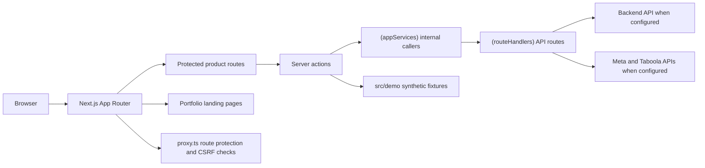

# Oracclum Frontend

Oracclum was built to help performance marketing teams connect campaign data,
ad spend, clicks, funnel events, sales, revenue, and ROAS in one operational
interface. This repository contains the main Next.js frontend adapted from the
original SaaS so it can be reviewed safely as a public project.

The original commercial operation is closed. This version keeps the product
experience and technical structure, while replacing production-sensitive pieces
with safe configuration, synthetic demo data, and a frontend-only demo mode.

## Quick Scan

This project demonstrates:

- A real SaaS-style dashboard built with Next.js App Router, React, TypeScript,
  Tailwind CSS, and server actions.
- Protected application flows with signed sessions, route protection, admin
  checks, CSRF origin validation, and API rate limiting.
- A BFF-style frontend architecture that separates internal app services from
  external route handlers.
- Demo mode that lets reviewers explore the product without the original
  backend or third-party credentials.
- Marketing analytics UI for campaigns, ads, sites, funnel steps, click data,
  revenue, spend, sales, and ROAS.
- Integrations designed around Meta Ads, Taboola, and checkout/postback event
  tracking.
- A tested and audited project baseline using npm, Jest, ESLint, and Next.js
  production builds.

## Product Context

The product goal was to give marketers a clearer way to optimize paid traffic
campaigns. Instead of looking only at ad-platform metrics, Oracclum connected
campaign clicks to downstream funnel and checkout events, allowing users to see
which ads, sites, and funnel steps were actually driving revenue.

Core user workflows include:

- Creating and managing tracked campaigns.
- Connecting Taboola and Meta Ads accounts.
- Mapping campaign traffic to funnel and checkout events.
- Reviewing campaign summaries across clicks, sales, revenue, spend, CPC, CPA,
  conversion rate, and ROAS.
- Inspecting ad-level and site-level performance.
- Testing integration URLs and click tracking behavior.
- Managing account settings, consent/terms acceptance, and user data deletion.


## Tech Stack

| Area | Technology |
| --- | --- |
| Framework | Next.js 16 App Router |
| UI runtime | React 19 |
| Language | TypeScript 6 |
| Styling | Tailwind CSS 4 |
| UI primitives | Radix UI, lucide-react |
| Charts/data viz | Recharts |
| Auth/session signing | jose |
| Testing | Jest 30, Testing Library |
| Linting | ESLint 9, eslint-config-next |
| Package manager | npm only |
| Node version | 24.16+ |

## Demo Mode

Demo mode is the recommended way to review this project.

It creates a signed local session with synthetic account data and routes the
main product flows to local fixtures instead of the original backend. This lets
reviewers explore the dashboard, campaign views, Meta screens, Taboola screens,
integration states, account settings, and destructive-action safeguards without
needing production credentials.

### Start a demo session

1. Install dependencies:

   ```bash
   npm ci
   ```

2. Create a local env file:

   ```bash
   cp .env.example .env
   ```

3. Make sure `SESSION_SECRET` in `.env` is set to a non-empty local secret.
   The placeholder value is enough for local review, but a real local secret is
   better during development.

4. Start the app:

   ```bash
   npm run dev
   ```

5. Open:

   ```text
   http://localhost:3000/login
   ```

6. Click:

   ```text
   Entrar em modo demo
   ```

After login, the app redirects to the protected campaign area.

### Demo data included

The frontend demo includes synthetic data for:

- User account and contract/session state.
- Taboola account connection.
- Meta account connection.
- Campaign summaries.
- Campaign optimization data.
- Taboola ads.
- Meta adsets and ads.
- Funnel steps.
- Site summaries.
- Revenue, spend, sales, CPC, CPA, conversion rate, and ROAS metrics.

The demo fixtures live in:

```text
src/demo/demoData.ts
src/demo/demoMode.ts
src/demo/demoSession.ts
```

## Main Features

### Landing and Public Pages

The public side presents the product concept and demo entry points:

- Home/landing page.
- Integration overview.
- Data deletion instructions.
- Signup and login pages.

Relevant folder:

```text
src/app/(LandingPage)
```

### Authentication and Session Flow

The app uses signed session cookies backed by `jose`.

Key points:

- Session tokens are signed with `HS256`.
- `SESSION_SECRET` is required when signing sessions.
- Cookies are `httpOnly`, `sameSite: "lax"`, and `secure` in production.
- Protected routes redirect unauthenticated users to `/login`.
- Logged-in users are redirected away from `/login`.
- Admin routes are protected by user type.
- Users who have not accepted terms are redirected to the config page.

Relevant files:

```text
src/lib/session.ts
src/lib/sessionSecret.ts
src/lib/sessionCookie.ts
src/proxy.ts
```

### Campaign Dashboard

The protected app area lets users review campaign performance and optimization
data.

Representative routes:

```text
/main/campaign
/main/campaign/[id]/[external_id]/ads
/main/campaign/[id]/[external_id]/sites
/main/campaign/[id]/[external_id]/funis
/main/campaign/meta/[id]/[external_id]/adsets
/main/campaign/meta/[id]/[external_id]/ads
/main/campaign/meta/[id]/[external_id]/funis
```

The dashboard covers:

- Campaign cards and summaries.
- Taboola campaign selection.
- Meta campaign selection.
- Ad-level and site-level metrics.
- Funnel event summaries.
- Click tracking validation.
- Campaign create, edit, delete, and integration flows.

Relevant folder:

```text
src/app/main/campaign
```

### Integrations

The project includes frontend flows and route handlers for:

- Taboola account data.
- Taboola campaigns and ads.
- Meta OAuth login/callback.
- Meta ad accounts.
- Meta campaigns, adsets, and ads.
- Pixel/integration status tracking.
- Checkout/postback URL generation.

Real credentials are not required for demo mode. Real integration testing uses
the environment variables documented below.

Relevant folders:

```text
src/app/main/integration
src/app/main/campaign/components/IntegrationTutorial
src/app/main/campaign/components/MetaIntegrationTutorial
```

### Account and Admin Areas

The app includes account/configuration flows and an admin users area:

```text
/main/configs
/main/admin/users
```

These areas cover:

- Enriched user/account data.
- Terms acceptance.
- Password change flow.
- Delete-my-data flow.
- Admin user list and status management.

## Architecture

The frontend is organized around Next.js App Router route groups and a small
data-access boundary.



### Important folders

| Path | Purpose |
| --- | --- |
| `src/app/(LandingPage)` | Public marketing, policy, deletion, signup/login entry points |
| `src/app/main` | Protected application experience |
| `src/app/(DataAccessLayer)/(appServices)` | Internal server-side callers and session helper routes |
| `src/app/(DataAccessLayer)/(routeHandlers)` | Next.js route handlers acting as the BFF/API layer |
| `src/components` | Shared UI components |
| `src/config` | Environment-driven app configuration |
| `src/context` | Client state providers |
| `src/demo` | Frontend-only portfolio/demo fixtures |
| `src/helper` | Formatting and data helpers |
| `src/hooks` | Shared hooks |
| `src/lib` | Session, cookie, and security utilities |
| `src/models` | TypeScript domain models |
| `src/utils` | Cross-cutting utilities, validators, rate limiting, wrappers |

### Data access naming

The route groups are named to make intent explicit:

- `(appServices)` contains internal app-side callers and helper routes used by
  server actions/components.
- `(routeHandlers)` contains public Next.js API route handlers. These handlers
  validate request/session context, normalize errors, call the backend or third
  parties when configured, and return API responses to the frontend.

Because these are Next.js route groups, the folder names do not change public
URLs.

## Security and Privacy Notes

This public version keeps the security-oriented parts that are relevant for
portfolio review:

- Signed sessions with `jose`.
- Explicit `SESSION_SECRET` handling.
- Production-aware secure cookie options.
- CSRF origin validation for state-changing API requests.
- Protected route checks in `proxy.ts`.
- Admin route protection.
- OAuth token handling that avoids exposing provider tokens in redirect query
  strings.
- Basic in-memory rate limiting for sensitive auth/account endpoints.

The in-memory rate limiter is appropriate for local/demo review. In a scaled
production deployment, it should be replaced with shared storage such as Redis,
the keys should be made stronger, for example, adding email and route also to the
rate limit validation

## Environment Variables

Copy `.env.example` to `.env` for local development.

| Variable | Required for demo? | Purpose |
| --- | --- | --- |
| `SESSION_SECRET` | Yes | Signs local session tokens |
| `NEXT_PUBLIC_APP_URL` | Recommended | Browser-facing app URL |
| `APP_URL` | Recommended | Server-side app URL fallback |
| `NEXT_PUBLIC_LANDING_URL` | No | Landing/signup back-link override |
| `BACKEND_API_URL` | No | Backend API base URL for real backend mode |
| `NEXT_PUBLIC_BACKEND_API_URL` | No | Public fallback for backend URL |
| `POSTBACK_BASE_URL` | No | Base URL for generated checkout postback URLs |
| `NEXT_PUBLIC_POSTBACK_BASE_URL` | No | Public fallback for postback URL generation |
| `ALLOWED_ORIGINS` | No | Comma-separated CSRF allowed origins |
| `CSRF_ALLOWED_ORIGINS` | No | Additional CSRF allowed origins |
| `FB_APP_ID` | No | Meta OAuth app id for real Meta testing |
| `FB_APP_SECRET` | No | Meta OAuth app secret for real Meta testing |
| `FB_REDIRECT_URI` | No | Meta OAuth redirect URI fallback |
| `META_OAUTH_REDIRECT_URI` | No | Preferred Meta OAuth redirect URI |
| `META_API_VERSION` | No | Meta API version, defaults to `v24.0` |
| `TABOOLA_API_BASE_URL` | No | Taboola API base URL |

Demo mode works without real Meta, Taboola, or backend credentials.

## Local Development

Use Node 24.16 or newer. The repository includes `.nvmrc` with:

```text
24.16
```

Install dependencies:

```bash
npm ci
```

Start development server:

```bash
npm run dev
```

Build for production:

```bash
npm run build
```

Start the production build:

```bash
npm start
```

Run lint:

```bash
npm run lint
```

Run tests:

```bash
npm test -- --runInBand
```

Run production dependency audit:

```bash
npm audit --omit=dev
```


## Quality Gates

Last verified during portfolio cleanup on 2026-06-14:

| Gate | Status |
| --- | --- |
| `npm ci` | Passing |
| `npm run lint` | Passing |
| `npm test -- --runInBand` | Passing, 16 suites and 88 tests |
| `npm run build` | Passing |
| `npm audit --omit=dev` | Passing, 0 vulnerabilities |


## Backend and Services

This repository is the frontend application only.

The original full system also involved backend APIs, ingestion services, SQS
processing, and lambda workers. Those services are intentionally not included
in this frontend repository.

The frontend is still structured to work with a backend when one is configured:

- `BACKEND_API_URL` controls the backend API base URL.
- Route handlers under `(routeHandlers)` proxy and normalize backend requests.
- Demo mode bypasses the backend with local fixtures.
