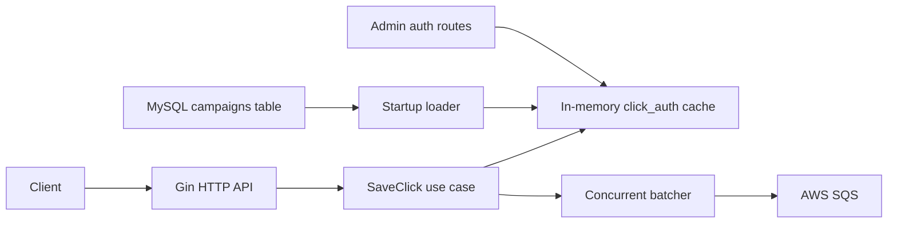

# tbl-ingestion-api

`tbl-ingestion-api` is a Go event ingestion API for click-tracking events. It validates incoming events with a `click_auth` token, enriches valid events with a campaign ID from an in-memory lookup, and buffers events into batched AWS SQS writes.

The project is intentionally small, but it exercises real backend concerns: request validation, clean package boundaries, in-memory read optimization, concurrent batching, queue delivery, and operational tradeoffs around reliability and shutdown behavior.

## Features

- HTTP API built with Gin.
- Startup load of `click_auth -> campaign_id` mappings from MySQL.
- Atomic in-memory resolver to avoid per-request database reads.
- Asynchronous SQS batching with deterministic key-based sharding.
- Complementary events for the same click ID are composed before batch flush.
- Runtime admin endpoints for campaign auth map updates.
- Unit tests for batching and click merge behavior.

## Architecture

For deeper architecture notes, see [`docs/architecture.md`](docs/architecture.md).



The code uses a practical layered structure:

- `cmd/api`: application entrypoint and dependency wiring.
- `internal/domain`: core click event model.
- `internal/usecase`: business logic and ports for lookup and queue output.
- `internal/adapter/http`: HTTP handlers and route registration.
- `internal/adapter/mysql`: campaign map loading from MySQL.
- `internal/infra/cache`: atomic in-memory token resolver.
- `internal/infra/batch`: generic concurrent batcher.
- `internal/infra/queue`: SQS sink and click merge rules.

## Ingestion Flow

1. The service starts and loads campaign mappings from the MySQL `campaigns` table.
2. Mappings are stored in memory as `click_auth -> campaign_id`.
3. A client posts a click event to `POST /clicks`.
4. The handler validates the JSON payload and checks `click_auth` against the cache.
5. The use case creates a normalized click event with a server-side ingestion timestamp.
6. The event is accepted into an in-process batcher.
7. Worker goroutines compose events with the same click ID into a single click state and flush batches to SQS.

The `click_auth` is generated by the main backend when a tracked campaign is created. It allows funnel pages to send events from arbitrary origins while still letting the ingestion API reject events that do not belong to a campaign tracked by the system.

HTTP requests return `202 Accepted` after the event enters the local batcher. Later SQS batch send failures are retried by the queue sender and reported internally if they remain unresolved.

## API

For the complete API contract, see [`docs/api.md`](docs/api.md).

### Health Check

```bash
curl http://localhost:8080/health
```

Response:

```text
ok
```

### Submit Click

```bash
curl -i -X POST http://localhost:8080/clicks \
  -H "Content-Type: application/json" \
  -d '{
    "id": "click-001",
    "click_auth": "demo-token",
    "tbl_campaign_id": "tbl-campaign-001",
    "site_id": "site-001",
    "ad_id": "ad-001",
    "step_1": "1",
    "step_2": "0",
    "step_3": "0",
    "checkout": "0"
  }'
```

Successful response:

```json
{
  "id": "click-001",
  "click_auth": "demo-token",
  "campaign_id": "campaign-001",
  "tbl_campaign_id": "tbl-campaign-001",
  "site_id": "site-001",
  "ad_id": "ad-001",
  "step_1": "1",
  "step_2": "0",
  "step_3": "0",
  "checkout": "0",
  "ingest_ts": 1720000000000,
  "path": "queued"
}
```

Status codes:

- `202 Accepted`: event accepted into the local batcher.
- `400 Bad Request`: invalid JSON, missing required fields, invalid progress fields, or unknown `click_auth`.
- `503 Service Unavailable`: request could not be accepted into the batcher before its timeout.

Error responses use a stable public shape:

```json
{
  "error": {
    "code": "invalid_click_auth",
    "message": "invalid click_auth"
  }
}
```

Known error codes:

| Status | Code | Message |
| --- | --- | --- |
| `400` | `invalid_request` | `invalid request body` |
| `400` | `invalid_click_auth` | `invalid click_auth` |
| `401` | `unauthorized` | `admin authorization required` |
| `503` | `queue_unavailable` | `unable to queue click event` |

Current required request fields are `id` and `click_auth`. The step fields are optional, but when present they must be non-negative integer strings because they represent progress values from the current ingestion payload shape.

### Admin Campaign Auth Routes

When a campaign is created in the main backend, that system generates a `click_auth`, saves the campaign to MySQL, and calls this endpoint so the running ingestion API can accept events for the new campaign immediately.

These routes update only the in-memory map. They do not write back to MySQL directly; persistence belongs to the main backend. On restart, the ingestion API reloads the campaign map from MySQL, including campaigns already saved by the main backend.

Admin routes are registered only when `ADMIN_TOKEN` is set and require a bearer token:

```bash
curl -i -X PUT http://localhost:8080/admin/clickauth \
  -H "Authorization: Bearer local-admin-token" \
  -H "Content-Type: application/json" \
  -d '{"token":"demo-token","campaign_id":"campaign-001"}'
```

```bash
curl -i -X DELETE http://localhost:8080/admin/clickauth/demo-token \
  -H "Authorization: Bearer local-admin-token"
```

## Configuration

The current application expects external MySQL and SQS-compatible infrastructure. A Docker-based local demo environment is planned, but is not included yet.

Use `.env.example` as a local template. On startup, the app automatically reads `.env` if that file exists. Values already exported in the shell take precedence over values from `.env`.

Required environment variables:

| Variable | Description |
| --- | --- |
| `SQS_QUEUE_URL` | Queue URL used by `SendMessageBatch`. |
| `DB_USERNAME` | MySQL user. |
| `DB_PASSWORD` | MySQL password. |
| `DB_NAME` | MySQL database name. |

Optional environment variables:

| Variable | Default | Description |
| --- | --- | --- |
| `ADDR` | `:8080` | HTTP listen address. |
| `AWS_REGION` | `sa-east-1` | AWS region for the SQS client. |
| `DB_HOST` | `127.0.0.1` | MySQL host. |
| `DB_PORT` | `3306` | MySQL port. |
| `SQS_ENDPOINT` | empty | Optional SQS endpoint override, useful for LocalStack. |
| `AWS_RETRY_LIGHT` | `false` | Set to `1` or `true` to reduce AWS SDK retry attempts. |
| `ADMIN_TOKEN` | empty | Enables `/admin/*` routes when set and is required as a bearer token. |

Public ingestion routes can receive browser requests from arbitrary funnel pages, so request origin is not the authorization boundary. Each tracked campaign has a `click_auth` generated by the main backend, and incoming events are accepted only when that token resolves to a campaign tracked by the system. Admin routes are kept outside the public CORS group.

The MySQL database must include a `campaigns` table with at least these columns:

```sql
CREATE TABLE campaigns (
  id VARCHAR(64) PRIMARY KEY,
  click_auth VARCHAR(255) NOT NULL UNIQUE
);
```

## Running Locally

This is the current manual setup. The repository will get a one-command Docker demo in a later cleanup step.

1. Start or connect to MySQL and create the `campaigns` table.
2. Insert at least one demo campaign/token pair.
3. Create or connect to an SQS-compatible queue.
4. Export the required environment variables create a .env file. Use `.env.example` as a template.
5. Run the API.

```bash
cp .env.example .env
# Edit .env if needed.

go run ./cmd/api
```

## Testing

Run the unit test suite:

```bash
make test
```

Run tests with the race detector:

```bash
make race
```

Run the API locally:

```bash
make run
```

## Design Notes

The in-memory resolver uses `atomic.Value` with copy-on-write updates. That keeps token lookups fast and lock-free for request handling while still allowing occasional whole-map refreshes or runtime campaign auth updates.

The batcher shards events by click ID so all updates for the same click land on the same worker. Within a worker buffer, complementary events are merged into a composed click state before flush. Progress fields keep the highest numeric value, while populated metadata fields are preserved or backfilled.

Each worker owns its own flush timer. A worker flushes when its buffer reaches the SQS batch size, when the worker has been quiet for the configured interval, or when the sink is closed during shutdown. Under continuous same-key traffic, repeated events can keep merging into one buffered item until that worker gets a quiet interval or the process shuts down.

SQS batches are capped at 10 entries to match the SQS `SendMessageBatch` limit. Retryable partial failures are retried by the queue sender; permanent failures are reported internally for follow-up handling.
