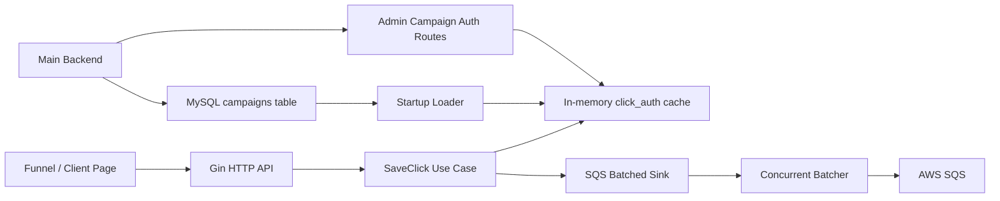
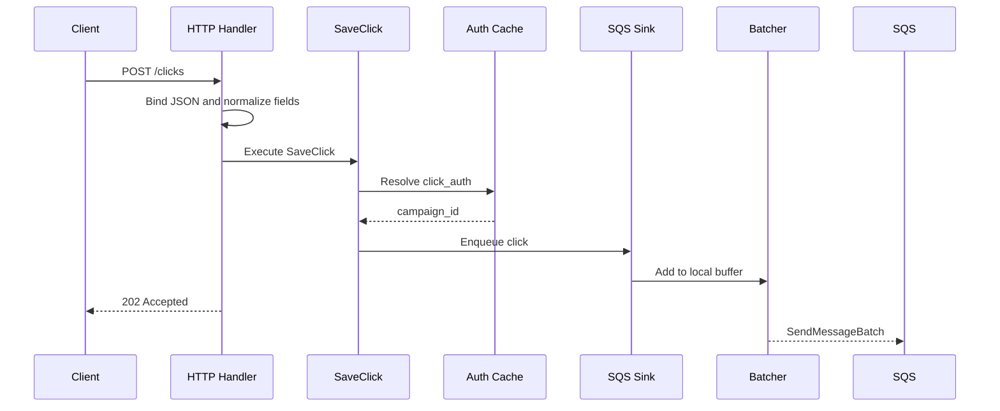

# Architecture

`tbl-ingestion-api` is a small Go service that receives click-tracking events, validates them against campaign auth tokens, composes complementary events for the same click, and sends the resulting click state to AWS SQS in batches.

The service is designed around a read-heavy ingestion path: request handling should validate and accept events quickly, while queue delivery happens asynchronously through an in-process batcher.

## System Overview



At startup, the API loads `click_auth -> campaign_id` mappings from MySQL into an in-memory resolver. During normal operation, funnel pages call `POST /clicks` with a `click_auth` token. The token is generated by the main backend when a campaign is created, and the ingestion API accepts events only when that token resolves to a tracked campaign.

When the main backend creates a new campaign, it persists the campaign to MySQL and calls the admin campaign auth endpoint so the running ingestion process can accept the new token immediately. If the ingestion API restarts later, it reloads the same campaign mapping from MySQL.

## Package Boundaries

| Package | Owns | Should Not Own |
| --- | --- | --- |
| `cmd/api` | Process startup, dependency wiring, AWS client setup, MySQL connection, route registration, graceful shutdown. | Business rules, request validation details, queue message formatting. |
| `internal/domain` | Core click event model. | Gin, MySQL, SQS, configuration, or transport-specific behavior. |
| `internal/usecase` | Application behavior: validate `click_auth`, build a normalized click, enqueue through ports. | Concrete cache, database, HTTP, or SQS implementations. |
| `internal/adapter/http` | HTTP routes, JSON binding, request normalization, public error responses, CORS/auth middleware. | Queue sending details, MySQL reads, business orchestration beyond calling use cases. |
| `internal/adapter/mysql` | Loading campaign mappings from MySQL. | Request-time validation or cache mutation policy. |
| `internal/infra/cache` | Atomic in-memory `click_auth -> campaign_id` resolver. | HTTP behavior, database persistence, SQS behavior. |
| `internal/infra/batch` | Generic concurrent batching, key-based sharding, buffered flush behavior, close/drain behavior. | Click-specific merge rules or SQS-specific message shape. |
| `internal/infra/queue` | SQS sink, click merge rules, SQS message construction, batch send retries, failure reporting. | HTTP request handling or campaign auth storage. |

The `SaveClick` use case depends on interfaces:

- `ClickAuthLookup` for campaign auth lookup.
- `ClickSink` for enqueueing normalized clicks.

That keeps the central application behavior independent from Gin, MySQL, SQS, and the cache implementation.

## Request Flow



The API returns `202 Accepted` after the event has entered the local batcher. This keeps request latency low and avoids waiting for a future SQS batch flush before responding.

If the request body is invalid, required fields are missing, progress fields are malformed, or `click_auth` does not resolve to a campaign, the request is rejected before enqueueing.

## Campaign Auth Flow

Campaign auth is synchronized by the main backend:

1. A campaign is created in the main backend.
2. The main backend generates a `click_auth` token for that campaign.
3. The campaign and token are persisted to MySQL.
4. The main backend calls `PUT /admin/clickauth` on the ingestion API.
5. The ingestion API updates its in-memory resolver.
6. Funnel pages can immediately send events using the new `click_auth`.

The admin route updates only process memory. This keeps the ingestion API focused on fast validation and event intake; persistence remains owned by the main backend and MySQL. On restart, the ingestion API reloads the campaign map from MySQL, including campaigns created while the previous process was running.

## Cache Lookup Design

The ingestion path is read-heavy. A funnel can generate many click events, and each event needs to answer one question quickly: does this `click_auth` belong to a tracked campaign?

Calling MySQL for every event would:

- add network latency to request handling,
- increase database load during traffic bursts,
- make ingestion availability more tightly coupled to database latency.

Instead, the service loads campaign mappings into an in-memory resolver backed by `atomic.Value`.

Reads are lock-free:

```text
click_auth -> campaign_id
```

Updates use copy-on-write:

1. Load the current map.
2. Copy it.
3. Apply the change to the copy.
4. Atomically swap the new map into place.

This favors the common path, where many requests read the cache and relatively few campaign auth updates occur.

## Batching, Sharding, And Merge Strategy

The SQS sink uses the generic batcher with these production defaults:

| Setting | Value | Reason |
| --- | --- | --- |
| Input buffer | `4096` | Absorb short ingestion bursts. |
| Workers | `30` | Allow concurrent batching work. |
| Batch size | `10` | Match the SQS `SendMessageBatch` limit. |
| Idle flush interval | `150ms` | Flush a worker's partial buffer after that worker has been quiet for the interval. |

Events are sharded by click ID. The batcher hashes the key returned by the sink, and for click events that key is `Click.ID`.

This matters because multiple events with the same click ID may be complementary parts of the same click state. By routing the same click ID to the same worker, the service can merge those events inside one worker buffer before sending to SQS.

Merge behavior:

- identity fields keep the first non-empty value,
- progress fields keep the highest numeric value,
- ingestion timestamp keeps the earliest received timestamp.

This turns several partial events for the same click into a more complete final click state when they land in the same worker buffer before a flush.

Each worker has its own timer. A worker flushes when:

- its buffer reaches the batch size,
- its input has been quiet for the idle flush interval,
- the sink is closed during shutdown.

This means `150ms` is not a strict maximum age for every buffered item. If same-key events keep arriving, they can be merged into the same buffered item until that worker becomes quiet, the batch reaches size, or shutdown closes the sink.

## SQS Delivery And Failure Handling

The queue adapter builds SQS batch entries from normalized clicks and calls `SendMessageBatch`.

For SQS partial failures:

- retryable failed entries are retried according to the sink retry policy,
- non-retryable failures are reported through the failure reporter,
- the sender preserves SQS entry IDs and click IDs in failure details,
- the final error includes failure context without exposing those internal details to API clients.

The default retry policy uses up to three attempts with short backoffs. Each send attempt has a timeout so an individual SQS request cannot hang indefinitely.

## Shutdown Behavior

The process handles `SIGINT` and `SIGTERM`.

On shutdown:

1. The HTTP server stops accepting new requests.
2. In-flight HTTP requests get a bounded shutdown window.
3. The SQS sink is closed.
4. The batcher rejects new enqueue calls.
5. Accepted enqueue calls finish.
6. Worker buffers are flushed.
7. The MySQL connection is closed.

The application uses a shutdown timeout so process termination does not wait forever on external systems.

## Tradeoffs

### `202 Accepted` Is Local Acceptance

The API responds after accepting an event into the local batcher. This improves request latency, but it means the response does not guarantee that SQS has already accepted the event.

### In-Memory Cache Requires Synchronization

The cache avoids per-request DB reads, but the running process must be kept in sync with campaign changes. This is handled by the main backend calling the admin campaign auth route after persisting a campaign.

### Batching Improves Throughput But Adds Delay

Batching reduces SQS call volume and allows click-state composition, but partial batches wait for a worker-level idle interval before being sent. Under continuous same-key traffic, merged events can remain buffered longer than one interval because each new event resets that worker's quiet-time timer.

### Merge Guarantees Are Per Process

Events with the same click ID are routed to the same worker inside one process. If traffic is split across multiple service instances, cross-instance merge behavior would need a shared downstream strategy.

### Admin Routes Mutate Runtime State

The admin campaign auth route updates in-memory state only. This is intentional because persistence belongs to the main backend, but it means operational correctness depends on the main backend persisting the campaign before calling the ingestion API.

### Failure Reporting Is Internal

SQS failures are retried and reported internally, while public API responses keep a stable, safe error shape. Production deployments would usually connect the failure reporter to structured logs, metrics, or a dead-letter workflow.
